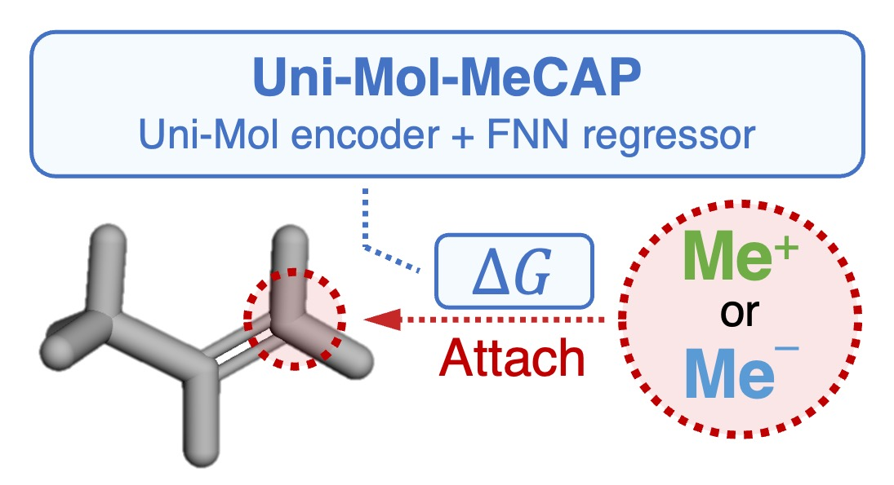

# Uni-Mol-MeCAP
Uni-Mol-backbone Methyl Cation/Anion Affinity Predictor

<p align="left">
  
</p>

## Environment

All requirements are written in `./envs/environments.yml`.

Please execute the following command to create conda environment.

```bash
conda env create -f ./envs/environment.yml -n mecap
```

## Training
### Data preparation
The dataset can be downloaded and preprocessed using `./data/references/data_preparation.ipynb`.

Please run all cells from top to bottom.

### Generate conformers
Run:
```bash
cd ./shell
bash generate_conformer.sh
```

### Build models and predict MCA/MAA by built models with reference-split
#### v1 models
Run: 
```bash
cd ./shell/unimol1/layer_0
bash train_and_predict_ref_mca.sh    # MCA prediction model
bash train_and_predict_ref_maa.sh    # MAA prediction model
```

#### v2 models
Run: 
```bash
cd ./shell/unimol2/layer_0
bash train_and_predict_ref_mca.sh    # MCA prediction model
bash train_and_predict_ref_maa.sh    # MAA prediction model
```

## Additional models
### Compound-based split
#### v1 models
Run: 
```bash
cd ./shell/unimol1/layer_0
bash train_and_predict_cpbased_mca.sh    # MCA prediction model
bash train_and_predict_cpbased_maa.sh    # MAA prediction model
``` 

#### v2 models
Run:
```bash
cd ./shell/unimol2/layer_0
bash train_and_predict_cpbased_mca.sh    # MCA prediction model
bash train_and_predict_cpbased_maa.sh    # MAA prediction model
```

### Train with different conformer types (only v1 model)
#### Generate (prepare) conformers
Run:
```bash
cd ./shell
bash diverse_conformer.sh
```

#### Build models and predict MCA/MAA by built models
Run:
```bash
cd ./shell/different_conformation

# xTB-optimized
bash train_and_predict_ref_mca_gth.sh    # MCA prediction model
bash train_and_predict_ref_maa_gth.sh    # MAA prediction model

# Force-field-optimized
bash train_and_predict_ref_mca_mmff.sh   # MCA prediction model
bash train_and_predict_ref_maa_mmff.sh   # MAA prediction model

# RMSD-max
bash train_and_predict_ref_mca_rmsd.sh   # MCA prediction model
bash train_and_predict_ref_maa_rmsd.sh   # MAA prediction model
```

### Train with different number of hidden layers in FFN
We evaluated the effect of the number of hidden layers in the FFN over the range $n \in \{0,1,2\}$.

#### v1 models
Run:
```bash
# Please change `{n}` to the number of hidden layers you want to execute..
cd ./shell/unimol1/layer_{n}
bash train_and_predict_ref_mca.sh    # MCA prediction model
bash train_and_predict_ref_maa.sh    # MAA prediction model
```

#### v2 models
Run:
```bash
# Please change `{n}` to the number of hidden layers you want to execute..
cd ./shell/unimol2/layer_{n}
bash train_and_predict_ref_mca.sh    # MCA prediction model
bash train_and_predict_ref_maa.sh    # MAA prediction model
```

## Analysis
All analyses (including reproduction of results in the published paper) can be run using `./data/results_analysis.ipynb`.

## Paper information
If you find our work useful, please cite our paper:

```
(Under preparation)
```

<!-- ```
@article{YIxxxxUniMolMeCAP,
  title = {Methyl Cation Affinity and Methyl Anion Affinity Prediction Using Uni-Mol-based Models},
  ISSN = {},
  url = {},
  DOI = {},
  journal = {},
  publisher = {},
  author = {Yuto, Iwasaki and Akinori, Sato and Tomoyuki, Miyao},
  year = {2025}
}
``` -->
